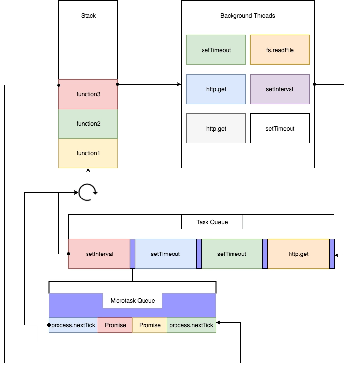

# Event Loop

event loop是一个执行模型，在不同的地方有不同的实现。浏览器和NodeJS基于不同的技术实现了各自的Event Loop，Javascript有一个main thread主线程和call-stack调用栈(执行栈)，所有的任务都会被放到调用栈等待主线程执行。我的笔记只记与浏览器相关的知识

---

## JS调用栈
JS调用栈采用的是后进先出的规则，当函数执行的时候，会被添加到栈的顶部，当执行栈执行完成后，就会从栈顶移出，直到栈内被清空。


## 同步任务和异步任务
Javascript单线程任务被分为同步任务和异步任务，同步任务会在调用栈中按顺序等待主线程依次执行。异步任务会在异步任务有了结果后，将注册的回调函数放入任务队列中等待主线程空闲的时候（调用栈被清空），被读取到栈内等待主线程的执行。
任务队列Task Queue，即队列，是一种先进先出的一种数据结构。    
js是单线程的，但是浏览器是多线程的，js碰到异步任务，并没有自己处理，而是交给了浏览器的其他线程。
浏览器的线程包括：事件触发线程、定时器线程、http请求线程等
​js异步任务常见的有：事件、定时器、网络请求等


## 宏队列和微队列


### 宏队列
macrotask，也叫tasks。一些异步任务的回调会依次进入macro task queue，等待后续被调用，这些异步任务包括：

- setTimeout  
- setInterval  
- requestAnimationFrame(更新动画)  
- I/O  
- UI rendering  

### 微队列
microtask，也叫jobs。另一些异步任务的回调会依次进入 mirco task queue，等待后续被调用，这些异步任务包括：  

- Promise  
- Object.observe(废弃)
- MutationObserver  

---


1. 执行全局Script同步代码，这些同步代码有一些是同步语句，有一些是异步语句；
2. 全局Script代码执行完毕后，调用栈Stack会清空；
3. 从微队列microtask queue中取出位于队首的回调任务，放入调用栈Stack中执行，执行完后microtask queue长度减1；
4. 继续取出位于队首的任务，放入调用栈Stack中执行，以此类推，直到把microtask queue中的所有任务都执行完毕。注意，如果在执行microtask的过程中国，又产生了microtask，那么会加入到队列的末尾，也会在这个周期被调用执行；
5. microtask queue中的所有任务都执行完毕，此时microtask queue为空队列，调用栈Stack也为空；
6. 取出宏队列macrotask queue中位于队首的任务，放入Stack中执行；
7. 执行完毕后，调用栈Stack为空；
8. 重复第3-7个步骤；
9. 重复第3-7个步骤；

执行栈在执行完同步任务后，查看执行栈是否为空，如果执行栈为空，就会去执行Task（宏任务），每次宏任务执行完毕后，检查微任务(microTask)队列是否为空，如果不为空的话，会按照先入先出的规则全部执行完微任务(microTask)后，设置微任务(microTask)队列为null，然后再执行宏任务，如此循环。

#### 3个重点
1. 宏队列macrotask一次只从队列中取一个任务执行，执行完后就去执行微任务队列中的任务
2. 微任务队列中所有的任务都被依次取出来执行，直到microtask queue为空；
3. 执行完所有的microtask之后，下一个macrotask之前，紧跟着执行UI render；

### 例子
```
setTimeout(()=>{
    console.log(1)
    Promise1...
})

setTimeout(()=>{
    console.log(2)
    Promise2...
})

顺序 1 Promise1 2 Promise2
```


```
console.log('script start')

async function async1() {
  await async2()
  console.log('async1 end')
}
async function async2() {
  console.log('async2 end') 
}
async1()

setTimeout(function() {
  console.log('setTimeout')
}, 0)

new Promise(resolve => {
  console.log('Promise')
  resolve()
})
  .then(function() {
    console.log('promise1')
  })
  .then(function() {
    console.log('promise2')
  })

console.log('script end')

script start
async2 end
Promise
script end
async1 end
promise1
promise2
undefined
setTimeout
```


