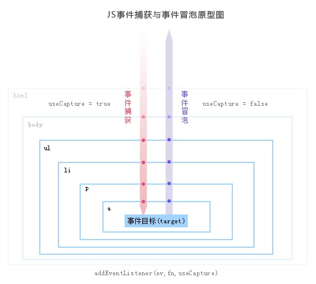

# 事件机制

DOM事件流（event flow ）存在三个阶段：事件捕获阶段、处于目标阶段、事件冒泡阶段。

事件捕获（event capturing）：通俗的理解就是，当鼠标点击或者触发dom事件时，浏览器会从根节点开始由外到内进行事件传播，
即点击了子元素，如果父元素通过事件捕获方式注册了对应的事件的话，会先触发父元素绑定的事件。

事件冒泡（dubbed bubbling）：与事件捕获恰恰相反，事件冒泡顺序是由内到外进行事件传播，直到根节点。

无论是事件捕获还是事件冒泡，它们都有一个共同的行为，就是事件传播。

dom标准事件流的触发的先后顺序为：**先捕获再冒泡**，即当触发dom事件时，会先进行事件捕获，捕获到事件源之后通过事件传播进行事件冒泡。

## addEventListener(event, listener, useCapture)

event---（事件名称，如click，不带on）  
listener---事件监听函数  
useCapture---是否采用事件捕获进行事件捕捉，默认为false，即采用事件冒泡方式

## DOM2事件模型
(1).事件捕获阶段，(2).事件目标阶段，(3).事件冒泡阶段。如下图所示

## event
event.preventDefault()//阻止元素默认的行为，如链接的跳转、表单的提交；
event.stopPropagation()//阻止事件冒泡

## 事件代理

将事件处理器绑定到一个父级元素上，避免了频繁的绑定多个子级元素,依靠事件冒泡机制与事件捕获机制，子级元素的事件将委托给父级元素。

### 好处
1. 最直接的就是，代码更整洁了，而且可读性更强。 
2. 对于动态化的页面，不用频繁的绑定事件，减少了内存泄露的概率。

注意：不是所有的事件都能冒泡的。blur、focus、load和unload不能像其它事件一样冒泡。事实上blur和focus可以用事件捕获而非事件冒泡的方法获得

## 事件委托
事件委托就是利用事件冒泡，只指定一个事件处理程序，就可以管理某一类型的所有事件。  

事件代理和事件委托实际上说的是同一件事，只是站在不同的角度来说的。比如说元素A把事件处理委托给自己的父元素B去处理，那么A就是事件委托方，而B就是事件代理方，两者参与的实际上是同一件事。

适合用事件委托的事件：click，mousedown，mouseup，keydown，keyup，keypress。

