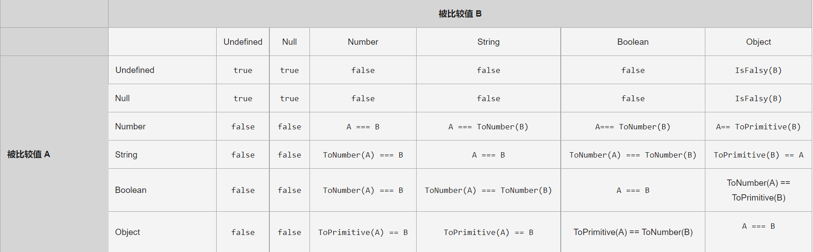

# 相等

## es6版本，四种相等的判断算法

```
全等 ===
等于 ==
零值相等 -0 === +0
同值相等 -0 !== +0 NaN === NaN

严格相等 === strict Equality
非严格 （抽象/非约束） == loose（自由的） Equality
Object.is(v1，v2) es6 新api 判断两个参数是否同一个值

=== 严格相等
不进行隐式类型转换 类型 值相同
引用值必须必须同一个地址

let obj ={} obj===obj true  {} === {} false
两个NaN 或者 和任何值都不相等
NaN !== NaN true
+0 -0相等
+0 === -0 true

+INFINITY 与 -INFINITY

+Infinity === +Infinity true
+Infinity === -Infinity false

题 定义变量 a
 a !== a true => NaN
 
 非严格相等 Abstract equality
隐式类型转换，两边都可能被转换
转换后用严格相等判断
```


在上面的表格中，ToNumber(A) 尝试在比较前将参数 A 转换为数字，这与 +A（单目运算符+）的效果相同。ToPrimitive(A)通过尝试调用 A 的A.toString() 和 A.valueOf() 方法，将参数 A 转换为原始值（Primitive）。

任何对象与 undefined null 不相等

```
窄对象 Narrow Object -> document.all
typeof document.all undefined
document.all === undefined true

全等在不隐式类型转换下更快

false 值 
false 0 -0 8n "" '' `` null undefined

同值相等 same-value
零值相等 same-value-zero

-0 !== +0 => 同值相等

var obj = {}

Object.defineProperty(obj,"a",{value:-0})
+0 0 会报错，不让定义
Object.defineProperty(obj,"a",{value:-0})

NaN ===NaN => 同值相等
Object.defineProperty 定义是相等的

同值相等底层是Object.is()

零值相等+0===-0

var obj = {}
Object.is(obj，obj) true 同一个引用
Object.is({}，{}) false 不是一个引用

```
